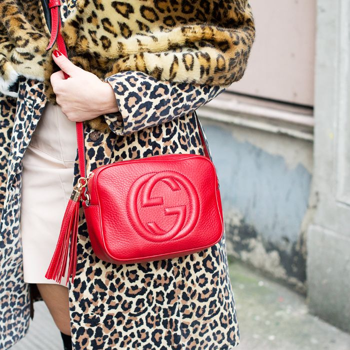
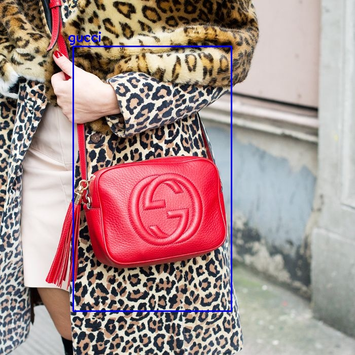

# Handbag Detection and Brand Recognition

 ## YOLO (You Only Look Once)
 
 We have less configuration of GPU(less then 2GB GPU) so we use a relatively small model: tiny-yolo. We made some changes to the original configuration file. e.g changing the filter numbers, batch sizes, classes and so on.
 
 After training the yolo model on about 2000 handbag images for 5000 epochs, we have the pre-trained weights file: handbag-tiny_5000.weights. 
 
 All the files are in the current directory, command below will apply object detection on the input image `bag.jpg`.
 
 `$ python detectcut.py --image bag.jpg --config handbag-tiny.cfg --weights handbag-tiny_5000.weights --classes handbag.names`
 
 `detectandcut.py` helps cut out the bounding box from an image, which is ready for further classification.
 
 **Command format** 
 
 _$ python detectcut.py --image /path/to/input/image --config /path/to/config/file --weights /path/to/weights/file --classes /path/to/classes/file_
 
 ### sample input:
 
 
 
 ### sample output :
 
 
 ### sample cutted image :
 

 
 
